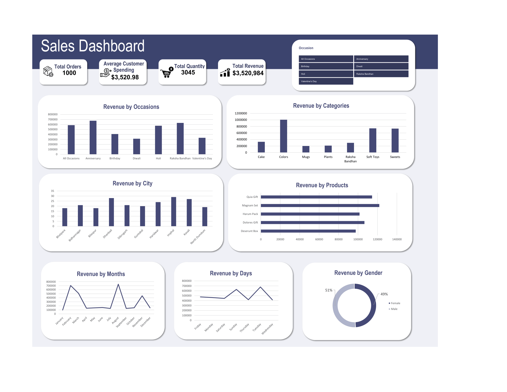

# Sales Analysis Dashboard

## Project Overview

This project presents an interactive **Sales Analysis Dashboard** developed in **Microsoft Excel** for a company specializing in delivering gifts for various occasions.

The objective of this project is to transform raw sales data into meaningful business insights that can help improve sales strategies, understand customer behavior, optimize delivery performance, and identify revenue-driving products and occasions.

## Problem Statement

The company wanted to analyze their sales data to uncover key business insights regarding:

- Overall revenue generation
- Customer purchasing behavior
- Product performance
- Delivery efficiency
- Occasion-based sales trends
- Regional sales performance

The dashboard was created to answer important business questions and support data-driven decision-making.

## Dashboard Objectives

The dashboard addresses the following business questions:

1. Identify the **Total Revenue** generated.
2. Calculate the **Average Order and Delivery Time**.
3. Analyze **Monthly Sales Performance** throughout 2023.
4. Determine the **Top Products by Revenue**.
5. Understand **Average Customer Spending**.
6. Track **Sales Performance of Top 5 Products**.
7. Identify the **Top 10 Cities by Number of Orders**.
8. Analyze **Order Quantity vs Delivery Time**.
9. Compare **Revenue Across Different Occasions**.
10. Identify **Product Popularity by Occasion**.

## Tools Used

- **Microsoft Excel**
  - Pivot Tables
  - Pivot Charts
  - Slicers
  - Conditional Formatting
  - Data Cleaning
  - Dashboard Design

## Key Performance Indicators (KPIs)

- Total Revenue
- Total Orders
- Average Customer Spending
- Average Delivery Time
- Monthly Revenue Trends
- Occasion-wise Revenue
- Product Performance
- City-wise Order Analysis

## Dashboard Features

- Interactive slicers for dynamic filtering

- Occasion-wise sales analysis

- Monthly sales trends

- Top-performing products analysis

- Customer spending insights

- Delivery performance analysis

- Geographic analysis of customer orders

- Visual comparison of revenue across occasions

## Dashboard Preview

## Business Insights

- Certain occasions contribute significantly more revenue than others.
- A few products generate a major portion of total sales.
- Customer demand varies throughout the year.
- Specific cities contribute the highest number of orders.
- Delivery times can vary depending on order quantity.
- Occasion-specific product preferences can help improve marketing campaigns.
